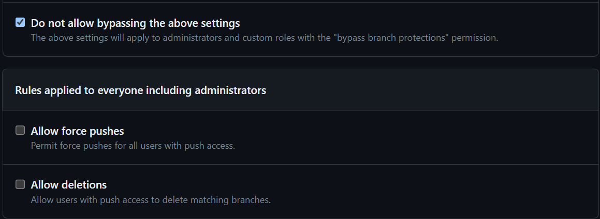

# First-Team-Project
This is the GitHub repo for our first team project (FTP) with branch protection turned on.

## Imporant Branch Protection Stuff
<li> The video in "06.3 Activity Files" indicates that we should set up the collaborative repo in this way</li>
<li> The old "Include Adminstrator" option is replaced by the "Do not allow bypassing the above settings".</li>.
<li> We won't be able to push directly to the Main branch.</li>
<li> To "build" a new branch type: git checkout -b branchname/example. (You may use / and - to distinguish branches.)
</li>
<li> To push while in a branch, you must, after commit, type: git push orgin branchname/example.</li>
<li> <h3>Before beginning any of your work, you're strongly recommended to return to the Main branch by typing: git checkout main, to do a "git pull" request to keep your data fresh.</h3></li> 
<li> To navigate back your to branch use the git checkout branchname/example command.</li>
<li> During merging on github, make sure to select your reviewer on the right sidebar so that someone will be notified to review and approve your merge request!</li>

### Credits
<li>Daniel aka Jianxiong Chen©</li>
<li>Kai Chen© </li>
